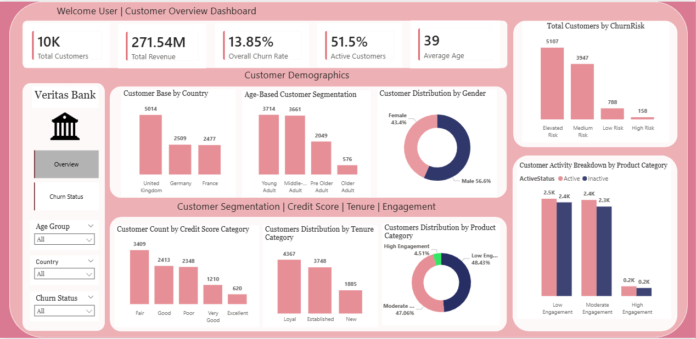
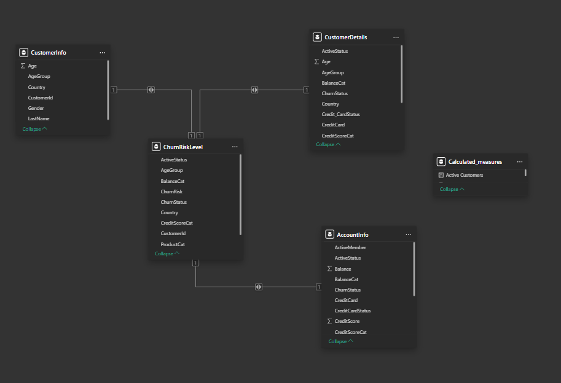

# Customer Churn and Retention Analytics for a UK-Based Multinational Retail Bank

## Overview
Veritas Bank, a UK-based multinational retail bank, faced rising customer churn across key European markets, particularly in Germany and France where fintech competitors were gaining traction.

Despite having extensive customer data, the bank lacked:
- Behavioural segmentation to identify at-risk customers
- Real-time visibility into churn risk
- A unified dataset for analysis
- Clear insight into churn drivers

This project transformed fragmented data into a centralized churn intelligence framework, enabling the bank to identify at-risk customers, understand churn behaviour, and implement targeted retention strategies.

---
## Business Challenge
The bank is experiencing rising customer churn, negatively impacting revenue and customer lifetime value. This trend is likely influenced by increased competition from fintech and neobanks, declining customer engagement in key regions such as Germany and France, and limited use of behavioural segmentation to identify at-risk customers. Furthermore, the absence of data-driven, real-time churn monitoring restricts the bank’s ability to implement proactive retention strategies.

---
## Rationale For The Project
Customer churn directly impacts revenue, profitability, and customer lifetime value.

A data-driven churn framework enables the bank to detect early disengagement, personalise retention strategies, and protect high-value customers.

This project provides the analytical foundation required to move from intuition-driven decisions to evidence-based retention strategies.

---
## Project Objectives
The project aimed to design and implement a scalable churn analytics solution that would:
- Identify demographic, behavioral, and financial factors influencing churn
- Segment customers by churn risk to support targeted interventions
- Build a structured analytical dataset optimized for reporting and predictive modeling
- Deliver interactive Power BI dashboards for real‑time churn monitoring
- Translate insights into actionable recommendations for marketing, CX, and product teams
  
Ultimately, the goal was to move the bank from reactive churn response to proactive, insight‑led retention.

---
## Project Scope
- Database setup and data importation 
- Data quality checks and exploratory data analysis 
- Feature engineering and churn-related column derivation 
- Creation of analytical views and segmentation tables 
- Power BI dashboard development (Demographics & Churn Analysis)
- Insight synthesis and stakeholder presentation

---
## Project Images

## Interactive Power BI Dashboard
Click below to explore the live dashboard
- [View dashboard](https://app.powerbi.com/view?r=eyJrIjoiMDkzNDgxYzItOWYyYi00YjYzLThjOTAtNjU5ZDhlZmFhZTE4IiwidCI6ImZmMGYzZTNhLTNlNTMtNDU0Zi1iMmI1LTZjNjg3NTNiOGVlNCJ9)

---
## Datasets
- [Find the first dataset here](./Dataset/AccountInfo.xlsx%20-%20AccountInfo.csv.csv)
- [Find the second dataset here](./Dataset/CustomerInfo.xlsx%20-%20CustomerInfo.csv.csv)

---
## SQL Queries used in This Project
Below are key SQL queries used for data extraction and transformation
- [Data Quality Checks](./Queries/data_quality_checks.sql)
- [Column Derivations](./Queries/column%20derivations.sql)
- [Customer segmentation](./Queries/customer_segmentations.sql)

---
## Key Insights
- Germany (18.06%) and France (17.52%) have significantly higher churn rates than the UK (9.93%), with churn nearly 1.8x higher, indicating regional performance gaps.
- Inactivity is a major churn driver, with the majority of churned customers coming from inactive segments, confirming strong behavioural influence.
- Young and middle-aged customers make up ~74% of the customer base and dominate high-risk segments, making them the most exposed group.
- Credit score and tenure show minimal impact on churn, with less than 2% variation, indicating that traditional financial metrics are weak predictors.
- Balance is a critical factor: customers with very low balances have a churn rate of 18.54%, while high-balance customers show 0% churn, highlighting revenue protection priorities.
- Over 90% of customers fall into medium or elevated risk categories, indicating a strong need for proactive churn management.
- Low engagement dominates the customer base (~48%), reinforcing the importance of engagement-driven retention strategies.
- Customers with credit cards show significantly lower churn, confirming that product adoption increases customer stickiness.

---
## Strategic Recommendations
- Implement Real-Time Churn Monitoring:
  - Develop a dynamic churn risk scoring model (High / Medium / Low) updated weekly based on customer behaviour.
  - This should trigger automated alerts for high-risk customers, enabling proactive retention interventions.
- Prioritise High-Churn Regions (Germany & France):
  - Focus retention efforts on underperforming regions by conducting competitor benchmarking and identifying gaps in customer experience.
  - Introduce targeted retention initiatives such as fee waivers, loyalty rewards, and enhanced digital engagement campaigns tailored to these markets.
- Shift from Tenure-Based to Behavioural Retention Strategies:
  - Move away from relying on customer tenure and instead focus on engagement metrics such as activity levels and transaction frequency.
  - Monitor inactive customers regularly and deploy personalised reactivation campaigns (e.g., cashback offers, product upgrades).
- Adopt a Dual Retention Strategy (Volume vs Value):
  - Segment customers based on value:
  - Low-balance customers: Use automated, cost-efficient digital nudges
  - High-balance customers: Provide personalised support through relationship management and exclusive incentives
This ensures efficient allocation of retention resources.
- Protect High-Value Customers with Early Intervention:
  - Monitor behavioural signals such as reduced transaction frequency or declining engagement.
  - Use these indicators to trigger early intervention strategies before churn occurs.

---
## Business Impact

This project provides a data-driven foundation for reducing customer churn and improving retention strategy.

By identifying key drivers such as inactivity, regional disparities, and low engagement, the bank can shift from reactive churn management to proactive intervention.

The proposed segmentation and monitoring framework enables:
- Early identification of at-risk customers
- Targeted retention strategies for high-risk regions
- Improved allocation of resources toward high-value customers

Overall, this approach supports improved customer lifetime value, reduced churn rates, and stronger competitive positioning.

---
## Tools & Techniques
- Microsoft SQL Server – Performed data extraction, cleaning, and transformation; handled missing values and engineered features to support churn analysis
- Microsoft Power BI – Built a data model, developed DAX measures (e.g., churn rate, customer segmentation), and designed interactive dashboards to uncover patterns in customer behaviour

